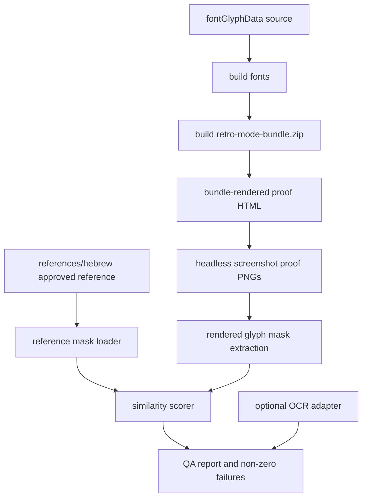

# Design Document

## Overview

Retro Hebrew glyph QA should be a repo-owned proof pipeline that evaluates the fonts as they actually ship. The pipeline builds or reads the retro theme bundle, extracts the font assets, renders Hebrew proof sheets in a headless browser, compares the rendered glyph masks against an approved reference, and emits reviewable proof images.

This is separate from the older "make the fonts better" task. This spec creates the ongoing guardrail that tells us whether the fonts are good enough and catches regressions later.

## Architecture



## Resolved Decisions

- Reference assets live under `references/hebrew/`.
- Runtime-bundle rendering is authoritative.
- Deterministic mask/template similarity is the primary pass/fail gate.
- OCR is optional and advisory in the first pass.
- The first implementation should prove one Hebrew letter end-to-end, then expand to the full alphabet.
- Thresholds belong in repo-local config so calibration does not require code edits.

## Proposed File Layout

Recommended additions:

- `references/hebrew/reference-hebrew-alphabet.png`
- `references/hebrew/reference-hebrew-alphabet.json`
- `config/hebrew-glyph-qa.toml`
- `scripts/hebrewGlyphQa.mjs`
- `scripts/render-hebrew-proof.mjs` extensions or a small shared proof module
- `artifacts/output/hebrew-glyph-qa/` for generated proof images and reports

The exact script names can shift, but the separation should remain:

- reference inputs under `references/hebrew/`
- thresholds and options under `config/`
- generated proof output under `artifacts/output/`
- executable QA logic under `scripts/`

## Reference Model

The reference model should support two shapes:

1. A user-approved reference image with metadata mapping letters to crop boxes.
2. A generated template fixture if the final reference is encoded as dot-matrix glyph data.

The first version can use whichever is faster to make trustworthy, but it must be explicit. The QA command should not guess glyph positions without metadata unless the reference is generated by the same command and therefore deterministic.

Recommended metadata shape:

```json
{
  "alphabet": "hebrew-final-forms-included",
  "letters": {
    "alef": { "char": "...", "x": 0, "y": 0, "width": 80, "height": 96 }
  }
}
```

The implementation should avoid depending on literal letter names in file paths where platform normalization might become awkward. Metadata can keep the actual character.

## Rendering Strategy

The existing `proof:hebrew` command already renders from `retro-mode-bundle.zip`. This spec should upgrade that proof from "visual screenshot" to "measured QA input."

Required rendering improvements:

- render per-theme alphabet sheets
- render per-letter cells with stable bounding boxes
- render representative Hebrew words or phrase lines
- include current/before and after/candidate outputs when comparing a change
- write the proof HTML next to PNG outputs for debugging

The renderer should not use user browser profiles. Playwright headless Chromium or the existing repo/browser sibling fallback is acceptable.

## Similarity Scoring

The primary check should:

1. normalize the rendered glyph crop and reference crop to monochrome masks
2. trim or align expected margins
3. calculate similarity using an interpretable score such as intersection-over-union or normalized pixel agreement
4. compare against a configurable threshold

Recommended initial config:

```toml
[hebrew_glyph_qa]
primary_metric = "mask_iou"
one_letter_poc = "alef"
glyph_threshold = 0.70
word_line_threshold = 0.62
ocr_required = false
```

The exact thresholds should be calibrated during the one-letter POC. The first task should not pretend the threshold is perfect before seeing measured output.

## OCR Strategy

OCR should be implemented as an optional adapter:

- if a supported OCR binary is configured or found, run it and record results
- if not found, skip with a clear advisory message
- do not fail CI solely because OCR is absent

This keeps QA useful on machines without OCR while preserving a path for stronger future checks.

## Glyph Correction Strategy

The correction work should happen against the same generated glyph source used by all four retro fonts. The loop is:

1. render broken/current bundle proof
2. adjust one Hebrew glyph in `fontGlyphData`
3. rebuild fonts and bundle
4. rerun one-letter QA
5. expand to the full Hebrew alphabet
6. save before/after proof artifacts

If different retro themes distort the same glyph differently through shape/skew/bevel settings, the QA report should identify whether the issue is the shared glyph bitmap or the theme-specific font style transform.

## Testing Strategy

### Unit/Script Tests

Add coverage for:

- missing reference file failure
- malformed reference metadata failure
- mask normalization and scoring
- threshold failure messages
- OCR skip behavior

### Bundle Verification

Extend the repo verification flow so it:

- builds fonts
- builds the retro bundle
- runs Hebrew glyph QA against that bundle
- fails when a glyph falls below threshold

### Proof Artifacts

The QA command should emit:

- alphabet proof PNG per run
- per-letter failure crops when failing
- JSON summary with theme/glyph scores
- optional OCR diagnostics when enabled

## Self-Review Notes

- This design reuses the existing bundle-rendered proof path instead of inventing a second renderer.
- It avoids environment fragility by making OCR optional.
- It treats the user's reference art as the product target, while keeping thresholds configurable because the first calibration will need real measurements.
- It keeps runtime behavior out of scope; this is a theme/font QA feature only.
